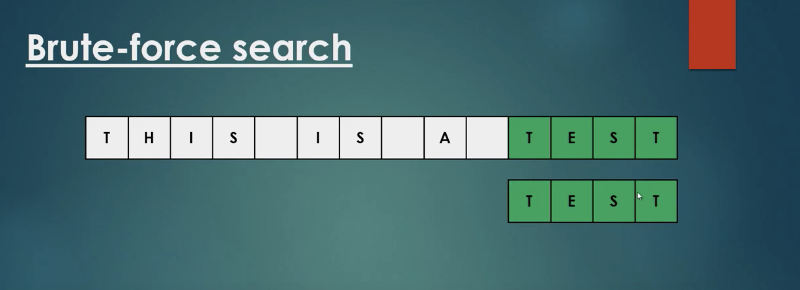

# [브루트포스] 개념 

# 브루트 포스란?

- **암호학에서** brute-force-attack(무차별 대입 공격)이란, 특정한 암호를 풀기 위해 가능한 모든 값을 대입하는 것을 의미한다. 충분한 시간이 존재한다면 암호화된 정보를 해독할 수 있지만 - 모든 경우의 수를 시도하므로 결국 암호를 풀게 된다 - 대부분의 경우 모든 계산을 마치려면 실용적이지 못한 비용이나 시간을 소요하게 된다.(출처 : 위키백과 [https://ko.wikipedia.org/wiki/무차별_대입_공격](https://ko.wikipedia.org/wiki/%EB%AC%B4%EC%B0%A8%EB%B3%84_%EB%8C%80%EC%9E%85_%EA%B3%B5%EA%B2%A9))

- **알고리즘으로서** brute-force-search(완전 탐색)이란, 브루트 포스 어택처럼 모든 가능한 경우의 수를 검색하는 것이다. 예를 들어 0-9까지의 숫자를 써서 만든 비밀번호를 풀기 위해서, 모든 가능한 수를 조합해 본다. 0000,0001,0002,...9999까지 총 10^4개의 경우의 수가 도출된다.

    만약 세일즈맨 알고리즘(traveling salesman problem)을 브루트 포스로 푼다고 하자. 이 세일즈맨은 한 지방의 10개의 도시를 한 번씩 방문해야 하는데, 최단 이동 거리를 갖는 경로를 찾는다.  완전 탐색으로 경로를 찾으려면 한 도시에서가능한 모든 경로를 탐색하고 가장 가까운 도시를 찾아 이동함으로써 결국 모든 경우의 수를 검색하게 된다. 이렇게 경우의 수를 다 찾기 때문에 반드시 정답을 찾게 되지만, 시간과 비용의 소요를 생각하면 비효율적이다. (출처 : [https://www.freecodecamp.org/news/brute-force-algorithms-explained/](https://www.freecodecamp.org/news/brute-force-algorithms-explained/))

- **시간 복잡도** 는 O(m*n)이 나온다.

# 브루트 포스 String-Matching

(1)

[https://www.youtube.com/watch?v=vtnpzDPgaU0&t=336s](https://www.youtube.com/watch?v=vtnpzDPgaU0&t=336s)



```java
/*
text : THIS IS A TEST
pattern : TEST
*/

public static int search(String text, String pattern){

	int lengthOfText = text.length();
	int lengthOfPattern = pattern.length();

	for(int i =0; i<(lengthOfText - lengthOfPattern); i++){
		
		int j;
		for(j=0; j<lengthOfPattern;j++){
			if(text.charAt(i+j) != pattern.charAt(j)){
					break;
			}
		}

		if(j==lengthOfPattern) return i;
	} 
	
	return lengthOfText; //return -1;

}
```

(2) 

[https://www.youtube.com/watch?v=pllZNZxq1us](https://www.youtube.com/watch?v=pllZNZxq1us)

```java
StringMatch(T[0..n-1], P[0..m-1])

for i <- 0 to n-m do
	j <- 0
	while j< m and P[j] = T[i+j] do
	j <- j+1 //j 한 칸 씩 옮겨가며 다음 문자 일치하는지 검사
	if j = m return i //패턴 길이만큼 일치하면 i반환
return -1 // 일치하지 않으면 -1 반환
```
